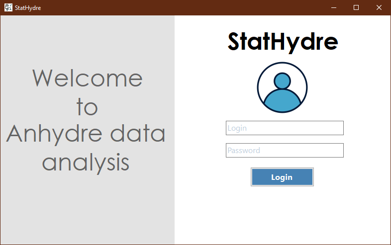

#### StatHydre - Manuel d'utilisation

## Table des matières
* [À propos](#à-propos)
* [Installation](#installation)
    * [Prérequis](#prérequis)
    * [Installations autres à effectuer](#installations-autres-à-effectuer)
* [Utilisation](#utilisation)
    * [Démarrage](#démarrage)
    * [Légendes](#légendes)

## À propos

StatHydre est un logiciel qui va vous permettre de visualiser des données afin de mieux percevoir les changements climatiques des différents pays du monde.

Ce manuel vous permettra de savoir comment exécuter le logiciel et de pouvoir le prendre en main et exploiter son plein potentiel.

## Installation

### Prérequis

- [.NET Framework 4.8](https://dotnet.microsoft.com/fr-fr/download/dotnet-framework/net48)
- [Python 3](https://www.python.org/downloads/)

### Installations autres à effectuer

Ce logiciel nécessite l'installation de quelques librairies supplémentaires, que vous pouvez installer depuis le script `install_libraries.bat` fourni avec votre distribution, que vous pouvez exécuter comme une application.

## Utilisation

### Démarrage



Lors du démarrage de l'application, une page de connexion s'affiche. Entrez les identifiant et mot de passe qui vous ont été fournis. Vous pouvez tester l'application avec les identifiants suivants :
```
Login : etd10
Password : yy4hbkd6
```
Après avoir cliqué sur Login, vous devriez accéder au le logiciel.

### Légendes


| Numéro | Description |
| ----------- | ----------- |
| 1 | Rechercher un pays, puis l'ajouter en cliquant dessus. |
| 2 | Liste des pays. Cliquez sur un des pays dans la liste pour le retirer. | 
| 3 | Choisir le type de graphe à générer. | 
| 4 | Choisir les bornes des dates à traiter. | 
| 5 | Effectuer une régression ou non. | 
| 6 | Générer le graphe et l'afficher à droite. | 
| 7 | Générer le graphe et l'ouvrir dans une nouvelle fenêtre. |
| 8 | Carte affichée après génération. | 
| 9 | Graphe affiché après génération. | 